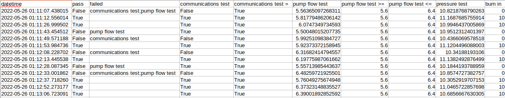

.. _saving-data-label:

Saving Data
===========

``MATS`` provides a very flexible module for saving data.

``ArchiveManager``
------------------

The builtin ``ArchiveManager`` is the default class built for saving data.  The ``ArchiveManager``
really implements one method, ``save()``.  The ``save()`` method accepts a ``dict`` as the parameter
which contains key: value pairs containing the results of a single test execution.

There is a very specific format for the dictionary which is passed into the ``save()`` method.  The
keys will represent the heading names.  The values of the ``dict`` will also be of a ``dict`` type
and will contain a "value" key with a value.  There is an optional nested "criteria" key which will
contain the "pass_if", "min" and "max" criteria, also as a dict.  An example would best illustrate:

.. code-block:: python

    {
      'datetime': {'value': '2021-01-05 22:07:26.181921'},
      'pass': {'value': True},
      'failed': {'value': '[]'},
      'communications test': {
        'value': True,
        'criteria': {'pass_if': True}
      },
      'pump flow test': {
        'value': 6.281,
        'criteria': {'min': 5.6, 'max': 6.4}
      }
    }

This dictionary will create the first row of data output below.  Any custom ``save()``
would need to support this data format.

Data Formats
------------

At this time, the ``mats.ArchiveManager`` supports two different output formats, both of which are
tab-delimited text files.

Data Format 0
*************

The default ``ArchiveManager`` output format is in the form of a tab-separated values file with the
pass-fail criteria placed at the top of the file.  To specify this data format unambigously during
initialization, then specify during object instantiation ``ArchiveManager(data_format=0)``.

.. code-block::

    communications test:pass_if=True
    pump flow test:min=5.6,max=6.4

    datetime	pass	failed	communications test	pump flow test	pressure test	burn in
    2022-05-26 01:04:17.221758	True	[]	True	6.234937183550046	10.498043011788305	10.0
    2022-05-26 01:04:31.565157	True	[]	True	5.9284197594696995	10.632408003984718	10.0
    2022-05-26 01:04:45.412396	True	[]	True	5.7448645640071545	10.085557361977978	10.0
    2022-05-26 01:04:59.559855	True	[]	True	5.691701511660488	11.142466478165602	10.0
    2022-05-26 01:05:15.406028	True	[]	True	6.278969944766333	10.974425457541233	10.0
    2022-05-26 01:05:29.553041	False	['pump flow test']	True	5.578744885226942	10.790385077321618	0.0
    2022-05-26 01:05:33.966749	True	[]	True	5.6133786548679705	10.896157851285196	10.0
    2022-05-26 01:05:47.914753	True	[]	True	5.728775166386706	10.001698218511283	10.0
    2022-05-26 01:06:10.674928	True	[]	True	6.243161490314319	10.859695255126715	10.0
    2022-05-26 01:06:27.231931	False	['pump flow test']	True	6.45646463351756	10.457709567667866	0.0
    2022-05-26 01:06:31.847073	True	[]	True	6.318803734234656	10.122658792283671	10.0
    2022-05-26 01:06:46.087559	False	['communications test']	False	5.608288967343877	10.62535894035169	0.0
    2022-05-26 01:06:53.212328	False	['pump flow test']	True	5.505826601915402	10.166725158164468	0.0

When imported into common spreadsheet software:

.. image:: ../_static/data-fmt-0.png

Note that the spacing is a bit off because the tabs are not aligned well.  This file will
import into packages such as pandas easily using::

    pd.read_csv('./path/to/file.txt', delimiter='\t', skiprows=3)

Data Format 1
*************

This data format intents to represent pass/fail constraints in the form of columns, meaning that
each column name that has a constraint will have one or more additional columns which specify that
column name with an additional modifier which describes the contraint.  For instance, if the column
names ``speed`` and ``speed >`` exist , then the ``speed >`` column indicates that speed must be
greater than the contents of the column.

.. code-block::

    datetime	pass	failed	communications test	communications test =	pump flow test	pump flow test >=	pump flow test <=	pressure test	burn in
    2022-05-26 01:11:07.438015	False	communications test;pump flow test	False	True	5.563650972683107	5.6	6.4	10.82187687902628	0.0
    2022-05-26 01:11:12.556014	True		True	True	5.817794862061415	5.6	6.4	11.168768575591445	10.0
    2022-05-26 01:11:26.999502	True		True	True	6.074734973459303	5.6	6.4	10.99464370058688	10.0
    2022-05-26 01:11:43.454512	False	pump flow test	True	True	5.500480152077348	5.6	6.4	10.951231240139677	0.0
    2022-05-26 01:11:49.571188	False	communications test	False	True	5.9925109838472705	5.6	6.4	10.436606957851806	0.0
    2022-05-26 01:11:53.984736	True		True	True	5.92373372158945	5.6	6.4	11.120449608800289	10.0
    2022-05-26 01:12:08.228702	False	communications test	False	True	6.316824147945569	5.6	6.4	10.34188193105997	0.0
    2022-05-26 01:12:13.445538	True		True	True	6.197759870616618	5.6	6.4	11.13824928764989	10.0
    2022-05-26 01:12:28.087345	False	pump flow test	True	True	5.5571398544363655	5.6	6.4	10.184419378895864	0.0
    2022-05-26 01:12:33.001862	False	communications test;pump flow test	False	True	6.482597219255007	5.6	6.4	10.857472738275735	0.0
    2022-05-26 01:12:37.718260	True		True	True	5.760492756749475	5.6	6.4	10.305291970715277	10.0
    2022-05-26 01:12:52.273177	True		True	True	6.37323148835527	5.6	6.4	11.046572285769773	10.0
    2022-05-26 01:13:06.723091	True		True	True	6.390018928525916	5.6	6.4	10.68566676303048	10.0

When imported into popular spreadsheet software:

Note that `failed` column contains strings which, when multiple failures are present, are separated by semicolons.
This format allows easy plotting of values vs. constraints over time.

Custom ArchiveManager Implementations
-------------------------------------

To create your own custom implementation that will save your data, you must:

1. Subclass ``ArchiveManager``
2. Implement a new ``save()`` method which accepts a single ``dict`` as \
   its parameter.

.. code-block:: python

    from mats import ArchiveManager

    class MyArchiveManager(ArchiveManager)
        def save(point: dict) -> None:
           # your custom save method
           ...

3. Create an instance of your new custom class:

.. code-block:: python

    mam = MyArchiveManager()

4. Supply the new instance to your test sequence:

.. code-block:: python

    ts = TestSequence(
        setup=setup,
        teardown=teardown,
        sequence=[T1(), T2()],
        archive_manager=mam  # <--- this is your ArchiveManager
    )

On every test execution, your new custom ``save()`` method will be called and supplied with the data
for one execution of your test sequence.
