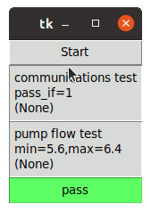

# Manufacturing Automated Test System (MATS)

`MATS` is a hardware-oriented test environment intended for production 
testing in a manufacturing environment.  The `MATS` framework is a test 
template and test sequence executor which includes an implementation for 
basic user input and feedback.

## Features

- Test runner
- Auto-start option
- Triggered-start option (i.e. "Start Button")
- Auto-save of data
- Hardware Setup / Teardown
- Automatic teardown on exception
- Automatic GUI integration

MATS could be considered an automated test framework which imposes a 
consistent work flow and reduces the amount of mind share that you need 
to dedicate to developing automated device tests.

Checkout the [documentation](https://mats.readthedocs.io/en/latest/index.html) 
for more details!

## Example GUI

At this time, the automatic GUI is only built within `tkinter`; however, the 
techniques used to create the `MatsFrame` should be applicable to any other
GUI framework.  Contributions welcome!

## Contribution Guidelines

Contribution guidelines are outlined in the 
[documentation](https://mats.readthedocs.io/en/latest/pages/contribution_guidelines.html).

Please read before contributing!
