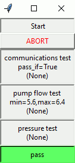

# Manufacturing Automated Test System (MATS)

`MATS` is a hardware-oriented test environment intended for production testing in a manufacturing 
environment.  The `MATS` framework is a test template and test sequence executor which includes
an implementation for basic user input and feedback.

MATS could be considered an automated test framework which imposes a consistent work flow and
reduces the amount of mind share that you need to dedicate to developing automated device tests.

Checkout the [documentation](https://mats.readthedocs.io/en/latest/index.html) for more details!

## Example GUI

## Contribution Guidelines

Contribution guidelines are outlined in the [documentation](https://mats.readthedocs.io/en/latest/pages/contribution_guidelines.html).

Please read before contributing!
